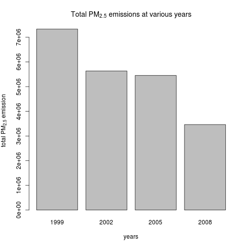
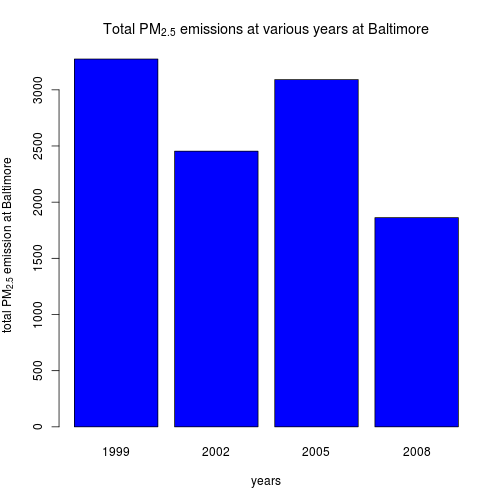
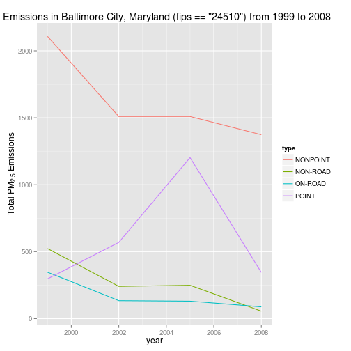
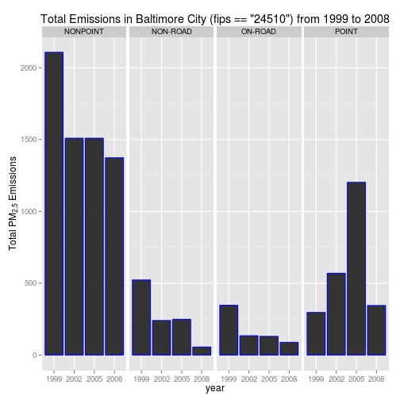
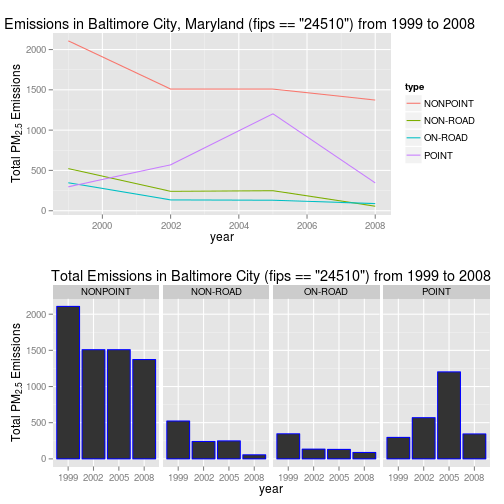
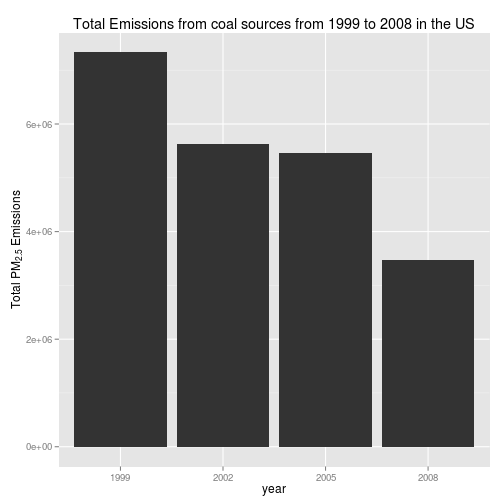
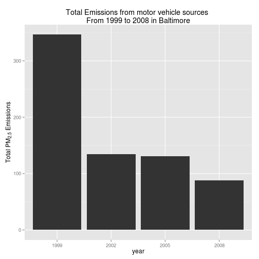
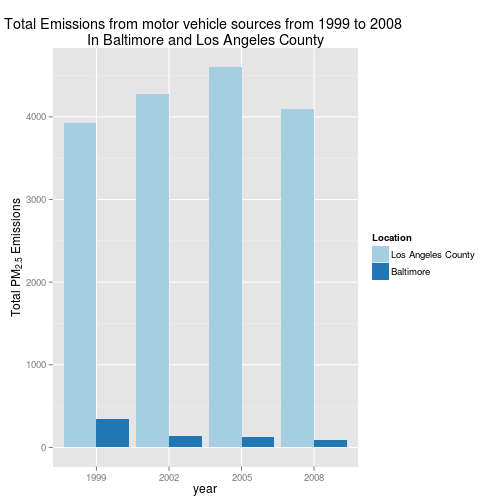

## Including the required library and reading the datasets required

```r
library(data.table)
library(ggplot2)
library(gridExtra)


source_classification_code <- data.table(readRDS('Source_Classification_Code.rds'))
summarySCC_PM25 <- data.table(readRDS('summarySCC_PM25.rds'))
```


### REQUIREMENT 1:
Have total emissions from PM2.5 decreased in the United States from 1999 to 2008? Using the base plotting system, make a plot showing the total PM2.5 emission from all sources for each of the years 1999, 2002, 2005, and 2008.


```r
setkey(summarySCC_PM25, "year") 
PM2_5_US <- summarySCC_PM25[, list(EMISSION=sum(Emissions)), by=key(summarySCC_PM25)] 
barplot(height=PM2_5_US$EMISSION, names.arg=PM2_5_US$year, xlab="years", ylab=expression('total PM'[2.5]*' emission'),main=expression('Total PM'[2.5]*' emissions at various years'))
```

 


### REQUIREMENT 2:
Have total emissions from PM2.5 decreased in the Baltimore City, Maryland (fips == "24510") from 1999 to 2008? 
Use the base plotting system to make a plot answering this question.


```r
setkey(summarySCC_PM25, "year","fips")
PM2_5_Baltimore <- summarySCC_PM25[fips == "24510", list(EMISSION=sum(Emissions)), by=key(summarySCC_PM25)]
barplot(height=PM2_5_Baltimore$EMISSION, names.arg=PM2_5_Baltimore$year,col='blue', xlab="years", ylab=expression('total PM'[2.5]*' emission at Baltimore'),main=expression('Total PM'[2.5]*' emissions at various years at Baltimore'))
```

 


### REQUIREMENT 3:
Of the four types of sources indicated by the type (point, nonpoint, onroad, nonroad) variable, which of these four sources have seen decreases in emissions from 1999–2008 for Baltimore City? Which have seen increases in emissions from 1999–2008? Use the ggplot2 plotting system to make a plot answer this question.


```r
PM2_5_Baltimore <- summarySCC_PM25[fips == "24510"]
setkey(PM2_5_Baltimore, "year","type")
PM2_5_Baltimore_Types <- PM2_5_Baltimore[, list(EMISSION=sum(Emissions)), by=key(PM2_5_Baltimore)]
types_plot_a <- ggplot(PM2_5_Baltimore_Types, aes(year, EMISSION, color = type))
types_plot_a <- types_plot_a + geom_line() +
  xlab("year") +
  ylab(expression('Total PM'[2.5]*" Emissions")) +
  ggtitle('Total Emissions in Baltimore City, Maryland (fips == "24510") from 1999 to 2008')
types_plot_a
```

 

```r
PM2_5_Baltimore_Types <- PM2_5_Baltimore[, list(EMISSION=sum(Emissions)), by=key(PM2_5_Baltimore)]
types_plot_b <- ggplot(PM2_5_Baltimore_Types, aes(as.character(year), EMISSION))
types_plot_b <- types_plot_b + geom_bar(stat="identity",colour = 'Blue') + facet_grid(.~type) +
  xlab("year") +
  ylab(expression('Total PM'[2.5]*" Emissions")) +
  ggtitle('Total Emissions in Baltimore City (fips == "24510") from 1999 to 2008')
types_plot_b 
```

 

```r
grid.arrange(types_plot_a,types_plot_b , nrow = 2)
```

 

### REQUIREMENT 4:
Across the United States, how have emissions from coal combustion-related sources changed from 1999–2008?


```r
coal_combust_US <- merge(source_classification_code,summarySCC_PM25,by='SCC')
setkey(coal_combust_US, "year")
coal_combust_US_pa <- coal_combust_US[, list(EMISSION=sum(Emissions)), by=key(coal_combust_US)]
coal_plot <- ggplot(coal_combust_US_pa, aes(factor(year), EMISSION))
coal_plot <- coal_plot + geom_bar(stat="identity") +
  xlab("year") +
  ylab(expression('Total PM'[2.5]*" Emissions")) +
  ggtitle('Total Emissions from coal sources from 1999 to 2008 in the US') 
coal_plot
```

 

### REQUIREMENT 5:
How have emissions from motor vehicle sources changed from 1999–2008 in Baltimore City?


```r
PM2_5_Baltimore <- summarySCC_PM25[fips == "24510"]
setkey(PM2_5_Baltimore, "year")
vehicle_pollute_Baltimore <- PM2_5_Baltimore[type=='ON-ROAD', list(EMISSION=sum(Emissions)), by=key(PM2_5_Baltimore )]
vehicle_plot <- ggplot(vehicle_pollute_Baltimore, aes(factor(year), EMISSION))
vehicle_plot <- vehicle_plot + geom_bar(stat="identity") +
  xlab("year") +
  ylab(expression('Total PM'[2.5]*" Emissions")) + 
  labs(title = 'Total Emissions from motor vehicle sources \nFrom 1999 to 2008 in Baltimore') + 
     theme(plot.title = element_text(hjust = 0.5))
vehicle_plot
```

 

### REQUIREMENT 6:
Compare emissions from motor vehicle sources in Baltimore City with emissions from motor vehicle sources in Los Angeles County, California (fips == "06037"). Which city has seen greater changes over time in motor vehicle emissions?


```r
baltimore_LA <- summarySCC_PM25[fips == "24510" | fips == "06037"]
setkey(baltimore_LA, "year","fips")
vehicle_baltimore_LA <- baltimore_LA[type=='ON-ROAD', list(EMISSION=sum(Emissions)), by=key(baltimore_LA)]
ggplot(data=vehicle_baltimore_LA , aes(x=as.character(year), y=EMISSION, fill=factor(fips,labels=c('Los Angeles County','Baltimore')))) +
  geom_bar(stat="identity",position=position_dodge()) +
  scale_fill_brewer(palette="Paired")+
  guides(fill=guide_legend(title="Location")) +
  xlab("year") +
  ylab(expression('Total PM'[2.5]*" Emissions")) +
  labs(title = 'Total Emissions from motor vehicle sources from 1999 to 2008 \nIn Baltimore and Los Angeles County') + 
     theme(plot.title = element_text(hjust = 0.5))
```

 
