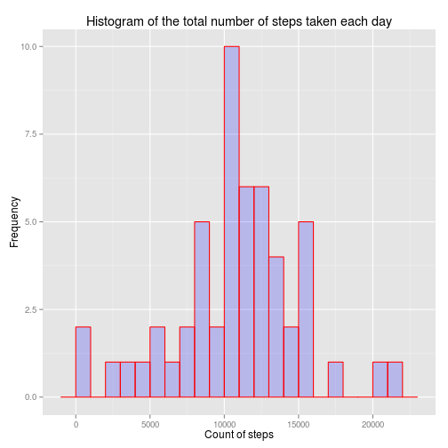
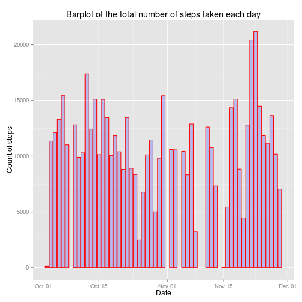
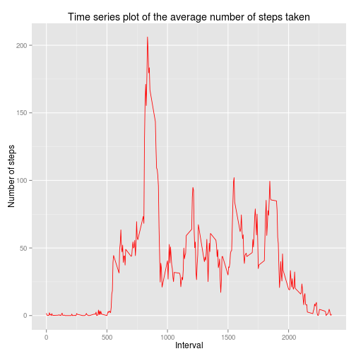
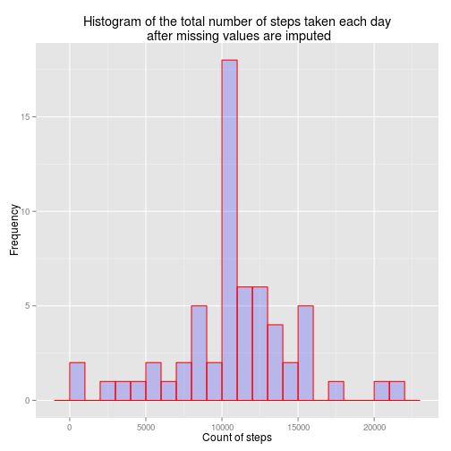
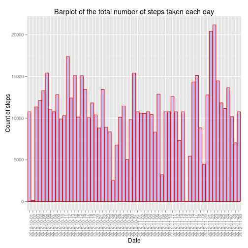
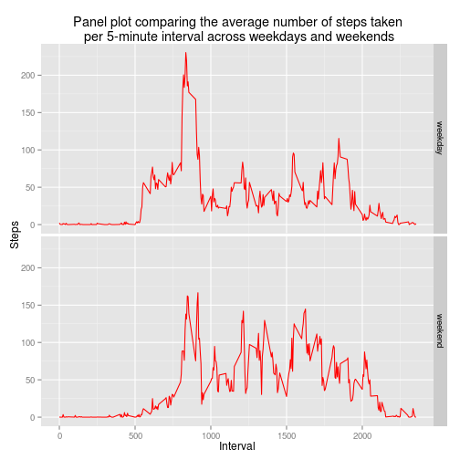

## Including the required library and reading the datasets required

The *raw_df* is a data frame constructed by reading directly from csv provided.It is then converted into data table format *raw_table*.
The *active_df* is data frame having removed all NA values.It is then converted into data table format *active_table*.
Also **date** in *active_df* is converted from factor to Date format.


```r
library(data.table)
library(ggplot2)

raw_df <- read.csv('activity.csv')
raw_table <- data.table(raw_df)

active_df <- raw_df[complete.cases(raw_df),]
active_df[,'date'] <- as.Date(active_df[,'date'], "%Y-%m-%d")
active_table <- data.table(active_df)
```

## REQUIREMENT 1

Here the total number of steps taken per day is calculated and a *histogram* and *barplot* plotted for the same.
[Difference between bar graphs and histograms can be found here](http://stattrek.com/statistics/charts/histogram.aspx?Tutorial=AP)
Owing to link shared,I was prompted for the bar graph.Please validate my understanding.

Also calculated is the mean and the median.

  

```
## Mean 10766.19
```

```
## Median 10765
```


## REQUIREMENT 2

Below code is to understand the average daily activity pattern.
This is achieved by a time series plot of the 5-minute interval and the average number of steps taken, averaged across all days.

Also the **_max_interval_** gives 5-minute interval, on average across all the days that contains the maximum number of steps.

 

```
## Interval with max number of steps 835
```

## REQUIREMENT 3
The **_na_number_** reports the total number of missing values in the dataset (i.e. the total number of rows with NAs)

NAs are filled using the mean number of steps for that 5-minute interval.This is achieved by finding mean steps across intervals and later imputing the same.Codewise the *data.table* chaining is used.

Histograms and bar plots of total number of steps taken per day are plotted with the imputed data.
Owing to my understanding,I also plotted the bar graph (feel its more informative).Please validate my understanding.

Also calculated is the mean and the median.

It is noticed that mean remains same whilst there is a slight change in the median.


```
## Number of NAs 2304
```

```
##         steps       date interval
##  1: 1.7169811 2012-10-01        0
##  2: 0.3396226 2012-10-01        5
##  3: 0.1320755 2012-10-01       10
##  4: 0.1509434 2012-10-01       15
##  5: 0.0754717 2012-10-01       20
##  6: 2.0943396 2012-10-01       25
##  7: 0.5283019 2012-10-01       30
##  8: 0.8679245 2012-10-01       35
##  9: 0.0000000 2012-10-01       40
## 10: 1.4716981 2012-10-01       45
```

  

```
## Mean of imputed data 10766.19
```

```
## Median of imputed data 10766.19
```


## REQUIREMENT 4

A new factor variable is created in the dataset with two levels – “weekday” and “weekend” indicating whether a given date is a weekday or weekend day.This is done using the **decide_day** function,inherently using *weekdays()* function.

A panel plot containing a time series plot of the 5-minute interval and the average number of steps taken, averaged across all weekday days or weekend days is later plotted.


```
##        steps       date interval     day
## 1: 1.7169811 2012-10-01        0 weekday
## 2: 0.3396226 2012-10-01        5 weekday
## 3: 0.1320755 2012-10-01       10 weekday
## 4: 0.1509434 2012-10-01       15 weekday
## 5: 0.0754717 2012-10-01       20 weekday
## 6: 2.0943396 2012-10-01       25 weekday
```

 
